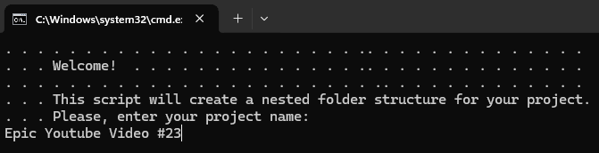
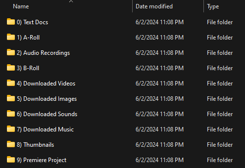

# Instant-File-Structure-by-etofok
 Instantly create a complex project structure for your projects.

 

 

 

[**Download >> Click Here**](https://github.com/etofok/Instant-File-Structure-by-etofok/releases/tag/v1.0.0)

[**etofok LinkTree >>**](https://linktr.ee/etofok)

## Quick Summary

Extremely simple app to instantly create a complex project structure for your projects.

Keeps everything neatly organized.

Also automatically adds current YEAR-MONTH-DAY to the project folder name (so everything is properly sorted).

I use this for my video editing projects, but this can be easily repurposed for anything else.

## How to Use

1. [Download Here >>](https://github.com/etofok/Instant-File-Structure-by-etofok/releases/tag/v1.0.0)

2. Find "Instant File Structure.bat" file

3. Place "Instant File Structure.bat" file in a folder where you want to create your projects folder in

4. Run "Instant File Structure.bat"

## How modify it

To modify it just open the "Instant File Structure.bat" file with Notepad or any other text editor. 
You'll see it creates folders in an order. 
Just change that part to your needs.
It's not complicated I promise.

## What's in the Package

| File Name                 | Extension         | Purpose |
| :----------------         | :------           | :---- |
| Instant File Structure (Video Editing Project)   |   .bat            | The App itself (RUN THIS!) |

[**etofok LinkTree >>**](https://linktr.ee/etofok)
