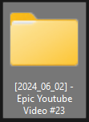

# Instant-File-Structure-by-etofok
 Instantly create a complex project structure for your projects.

 

 

 

[**Download >> Click Here**](https://github.com/etofok/Toggle-All-Microphones-by-etofok/releases/)

[**etofok LinkTree >>**](https://linktr.ee/etofok)

## Quick Summary

Extremely simple app to instantly create a complex project structure for your projects.

Keeps everything neatly organized.

Also automatically adds current YEAR-MONTH-DAY to the project folder name (so everything is properly sorted).

I use this for my video editing projects, but this can be easily repurposed for anything else.

## What's in the Package

| File Name                 | Extension         | Purpose |
| :----------------         | :------           | :---- |
| Instant File Structure (Video Editing Project)   |   .bat            | The App itself (RUN THIS!) |

[**etofok LinkTree >>**](https://linktr.ee/etofok)
